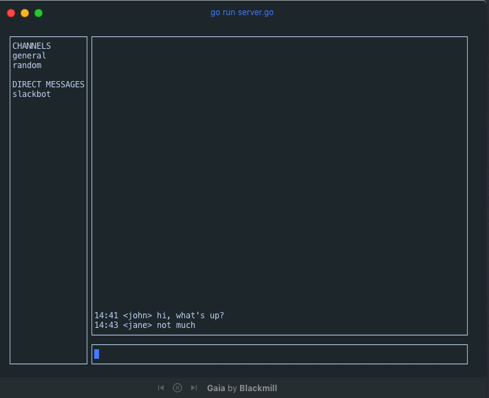

<p align="center">
  <!-- <a href="#">
     
  </a> -->
</p>

<br>

<p align="center">
gochat is a simple CLI chat client
</p>

<br>
<p align="center">
   <a href="#">
    
  </a>
  <a href="https://goreportcard.com/badge/github.com/imthaghost/gochat"></a>
</p>
<br>



### 📚 Table of Contents

1. [Project Structure](#project-structure)
2. [Getting Started](#getting-started)
3. [Deliverables](#deliverables)
4. [Resources](#resources)

## Project Structure

```bash
📂 gochat
├── README.md
├── client
│   └── client.go
├── docs
│   └── media
│       └── chat.png
├── go.mod
├── go.sum
├── protocol
│   └── writer.go
├── server
├── server.go
└── ui
    ├── chatview.go
    ├── cmd
    │   └── main.go
    └── tui.go
```

## Deliverables

[] There is a single chat room
[] User can connect to the server
[] User can set their name
[] User can send the message to the room, and the message will be broadcast to all other users.

## Getting started

> Start the server

```bash
go run server.go
```
